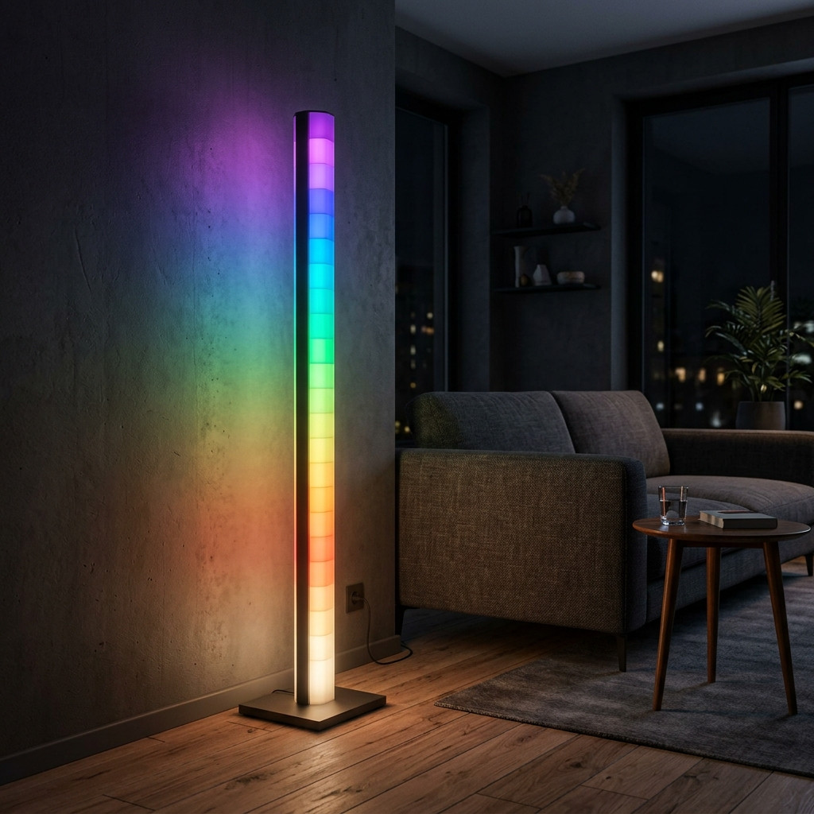

# glowctl

[](https://www.python.org/downloads/)
[](https://creativecommons.org/licenses/by-sa/4.0/)

`glowctl` is an open-source Python library and command-line interface for controlling **Glowrium** (INLEDCO) LED floor lamps over Bluetooth Low Energy (BLE).

---

## Hardware & Protocol Architecture

Target device: **Glowrium H4 Smart LED Corner Floor Lamp** (Model `Glowrium-C045`).



### Hardware Specifications

| Property | Specification |
|---|---|
| **Model** | Glowrium H4 / Glowrium-C045 |
| **System-on-Chip** | ESP32 SoC |
| **Light Output** | 1440 Lumens |
| **Power Rating** | 36 Watts |
| **Illumination Angle** | 160° Wide-Angle Glow |
| **Color Technology** | RGB+IC + Dedicated Warm Yellow (4-Channel RGBY per segment) |
| **Color Temperature** | 2000K (Warm Yellow) to 7500K (Cool Daylight) |
| **Spatial Array** | 20 Vertically Addressable Segments (indexed top-to-bottom) |
| **Wireless Protocol** | Bluetooth Low Energy (BLE GATT `facebd00`) + 2.4GHz Wi-Fi |

* **20 Addressable Segments**: The column contains 20 vertical segments indexed top-to-bottom.
* **4-Channel RGBY Emitters**: Each segment features independent **Red, Green, Blue, and Yellow** channels. The yellow emitter is a dedicated channel rather than a synthesized RGB blend.
* **CBOR over BLE GATT**: Device state and command frames use CBOR property maps sent over characteristic `facebd01` and read/notified on `facebd02` under service `facebd00-7261-6262-6974-696f74626c65`.

---

## Supported Features

- **Power & Brightness**: Turn hardware on/off and set global luminance (0–100%).
- **Spatial RGBY Color Control**: Paint individual segments or the full column with 4-channel color maps.
- **On/Off Fade Transitions**: Configure gradual brightness fade durations.
- **Schedules & Timers**: Program up to five recurring alarm timers, hourly chimes, and sunrise/sunset schedules.
- **Dynamic Animation Modes**: Capture, replay, and synthesize multi-step animation sequences (`DyData` program maps).

---

## Installation

Requires Python 3.10+ and a BLE-capable Bluetooth adapter (Bluetooth 4.0+ / 5.0+).

```bash
pip install -e .
```

### OS Requirements & Permissions

- **Linux**: Requires `bluez` and `bluetoothd` active. To allow non-root Python scripts to access the Bluetooth adapter without `sudo`:
  ```bash
  sudo setcap 'cap_net_raw,cap_net_admin+eip' $(readlink -f $(which python3))
  ```
- **Windows**: Requires Windows 10/11 with Bluetooth enabled. `bleak` uses WinRT APIs (`Windows.Devices.Bluetooth`) natively without additional drivers.
- **macOS**: Ensure your terminal emulator (e.g. `Terminal.app` or `iTerm2`) has Bluetooth permission under **System Settings > Privacy & Security > Bluetooth**.

---

## Command Line Usage (`glowctl`)

### Discovery & Status

```bash
glowctl scan                      # Discover advertising Glowrium lamps
glowctl info                      # Display device identity and GATT services
glowctl state                     # Read and decode full property map
glowctl state --programs          # Print decoded 20-segment RGBY values
glowctl segments                  # Visual breakdown of current segment colors
glowctl watch                     # Stream live GATT notifications
```

### Basic Control

```bash
glowctl on
glowctl off
glowctl --fast on                 # Fire-and-forget mode (< 0.5s response)
glowctl brightness 75             # Set global luminance (0-100)
glowctl color 255 0 0             # Set all segments to RGB (Yellow default 0)
glowctl color 255 128 0 100       # Set explicit Red, Green, Blue, Yellow channels
glowctl --scan on                 # Force fresh BLE scan instead of cached device address
```

### Schedules & Timers

```bash
glowctl gradual on --seconds 25   # Set power transition fade time
glowctl chime on --start 07:00 --end 22:00
glowctl countdown 600             # Start countdown timer in seconds (0 disables)
glowctl sunrise on --rise 06:00 --set 21:00
glowctl timers                    # View programmed timer slots
glowctl timer 2 07:30 --repeat daily --action on
```

### Animation Modes

```bash
glowctl mode list                 # List available captured mode profiles
glowctl mode campfire             # Replay a specific animation profile
glowctl capture-mode aurora       # Save active device program to a local profile
glowctl raw 'a1 02 f5'            # Write custom CBOR hex frame to command characteristic
```

---

## Python API Usage

`glowctl` can be embedded directly into custom Python applications, home automation scripts, or integrations. For full API specifications, notification callbacks, device setting encoders, and scene synthesis parameter tables, see **[docs/INTEGRATION_AND_SCENES.md](docs/INTEGRATION_AND_SCENES.md)**.

### Basic Control

```python
import asyncio
from glowctl import discover, LampTransport, protocol

async def main():
    lamps = await discover(stop_on_first=True)
    if not lamps:
        print("No lamp found.")
        return

    async with LampTransport(lamps[0].device) as lamp:
        # Power on
        await lamp.write(protocol.encode_power(True))

        # Render a top-to-bottom color gradient (Red to Green)
        gradient = [(255 - i * 12, i * 12, 0, 0) for i in range(20)]
        await lamp.write(protocol.encode_segment_colours(gradient))

asyncio.run(main())
```

### Custom Scene & Animation Synthesis

```python
import asyncio
from glowctl import discover, LampTransport, build_dydata, modes, protocol

async def main():
    lamps = await discover(stop_on_first=True)
    async with LampTransport(lamps[0].device) as lamp:
        # Override parameters of a captured mode template
        template = modes.get("custom_descent")[24]
        program = build_dydata(
            template,
            palette=[(255, 0, 0, 0), (0, 255, 0, 0), (0, 0, 255, 0)],
            led_count=10,
            speed=40,                            # Speed scale (0-100)
            brightness=100,
            direction=1,
            tail_length=2,
        )
        frame = protocol.encode_mode(modes.get("custom_descent")[19], program)
        await lamp.write(frame)

asyncio.run(main())
```

## Documentation & Wiki

Comprehensive guides are available in the repository `docs/` directory and on the [GitHub Repository Wiki](https://github.com/martinbogo/glowctl/wiki):

* **[Protocol Specification](docs/PROTOCOL.md)**: Wire protocol specification, CBOR property maps, GATT layout, and hardware timing.
* **[Integration & Scene Building Guide](docs/INTEGRATION_AND_SCENES.md)**: Python library integration, device settings API, and custom dynamic scene synthesis (`build_dydata`).
* **[CLI Reference](docs/CLI_REFERENCE.md)**: Complete command-line interface reference and `--fast` performance options.

---

## Technical Notes

* **Segment Indexing**: The device stores physical segment data bottom-first in memory. `glowctl`'s high-level functions automatically map indices top-to-bottom (index `0` corresponds to the top segment).
* **Connection State**: The lamp advertises over BLE only when no central device is connected.
* **Notification Readbacks**: Command writes to characteristic `facebd01` trigger notification echoes on `facebd02`, providing real-time state confirmation.

---

## Testing

Run the full pytest suite (104 hardware-verified test cases):

```bash
pytest tests/
```

---

## License & Disclaimer

Distributed under the [Creative Commons Attribution-ShareAlike 4.0 International License](LICENSE) (CC BY-SA 4.0).

*Disclaimer*: Glowrium and INLEDCO are trademarks of their respective owners. This project is an independent open-source library and is not affiliated with or endorsed by trademark holders.
